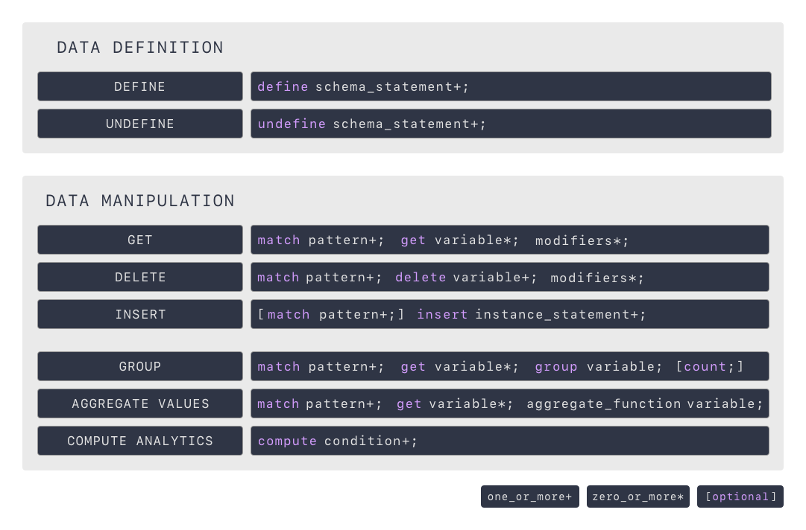

## Graql Query Language

Graql is the query language for the Grakn knowledge graph. Whether it's through the [Grakn Console](../02-running-grakn/02-console.md) or one of the [Grakn Clients](../03-client-api/00-overview.md), Grakn accepts instructions and provides answers only in its own language - Graql.

**Graql is declarative**.
When writing Graql queries, we simply describe **what** information we would like to retrieve, rather than **how** should it be obtained.
Once we specify the target information to retrieve, the Graql query processor will take care of finding an optimal way to retrieve it.

**Graql is intuitive**.
Graql was designed to provide a high-level query language interface with clear and human-readable syntax. By defining high-level application-specific [schema](../09-schema/00-overview.md), we effectively define our own vocabulary to talk about the domain of interest. By introduction of an explicit data model tightly reflected in the structure of the query language, formulating queries comes naturally as it is reminiscent of building ordinary sentences about our domain. The more tightly the schema represents our domain of interest, the more intuitive writing and reading Graql queries become.

**Graql serves as both the Data Manipulation Language (DML) as well as the Data Definition Language (DDL)**
Graql is a language that provides you with a complete set of tools to perform all data-oriented tasks. This includes defining the schema, retrieving information as well as creating and manipulating data.

## The structure of a Graql query

The image below illustrates the structure of various Graql queries.

As shown in the image above, Graql queries are categorized into two main types:
- **Data Definition**:
  - **[Define](../09-schema/01-concepts.md#define)**: adds definition of a concept type to the schema.
  - **[Undefine](../09-schema/01-concepts.md#undefine)**: removes definition of a concept type from the schema.

- **Data Manipulation**:
  - **[Get](../11-query/02-get-query.md)**: returns the data instances or concept types that match the preceding pattern(s), optionally limited by, sorted by or offset by the given modifiers.
  - **[Delete](../11-query/04-delete-query.md)**: removes the data instances assigned to the given variable that match the preceding pattern(s), optionally limited by, sorted by or offset by the given modifiers.
  - **[Insert](../11-query/03-insert-query.md)**: inserts a data instance according to the given statement(s), optionally, preceded by a `match` clause.
  - **[Group](../11-query/06-aggregate-query.md#grouping-answers)**: always as a part of a `get` query, returns the results grouped by the given variable, optionally mapped to the count of each group.
  - **[Aggregate Values](../11-query/06-aggregate-query.md#aggregate-values-over-a-dataset)**: always as a part of a `get` query, returns the statistical value of numeric attributes based on the given aggregate function.
  - **[Compute Statistics](../11-query/07-compute-query.md)**: computes paths between two instances, clusters and centrality.

## Graql Answers

Some Graql queries such as `get`, `aggregate` and `compute` are expected to return an answer. Depending on the type of query, the structure of the answer may be different (more on Answer types in the [Client API](../03-client-api/00-overview.md#investigating-answers) section). As a part of the [Concept API](../04-concept-api/00-overview.md), we can call various methods on the concepts contained in an answer to retrieve more explicit and implicit knowledge about them and their surroundings.
