## Comparing SQL to Graql

Since the 1970s, SQL has been the de facto language to work with databases. As a declarative language, it’s straightforward to write queries and build powerful applications. However, relational databases struggle when working with interconnected and complex data. When working with such data in SQL, challenges arise especially in the modelling and querying of the data.

Graql is the query language used in [Grakn](https://github.com/graknlabs/grakn). Just as SQL is the standard query language in relational databases, Graql is Grakn’s query language. Both SQL and Graql are declarative query languages that abstract away lower-level operations. Both are:

- Languages that attempt be readable and understandable
- Languages that attempt to enable asking questions at a higher-level
- Languages where the system figures out how to do lower-level operations

In practical terms, this means the languages become accessible to groups of people who would have otherwise not been able to access them. In this documentation, while we look at specific common concepts, we focus on comparing and exploring the differences between the two languages. 

### The Origin of SQL and the Relational Model

In 1970, a [paper](https://dl.acm.org/doi/10.1145/362384.362685) was published by an Oxford-educated mathematician called [Edgar Codd](https://en.wikipedia.org/wiki/Edgar_F._Codd), known as "Ted", and in it, he introduced two languages -- a relational algebra and a relational calculus to express extremely complex queries. When they came out, they were considered to be a strange kind of mathematical notation. To build these ideas out into a database management system, Ted created a research group called [System R](https://en.wikipedia.org/wiki/IBM_System_R), based out of the IBM research facilities in San Jose. 

Back then, databases were mainly based on [navigational](https://databasemanagement.fandom.com/wiki/Navigational_Database), [network](https://www.techopedia.com/definition/20971/network-database) and [hierarchical](https://www.techopedia.com/definition/19782/hierarchical-database) models, where we needed to know the physical data layer before we could write a navigational plan to describe our query. Ted, however, saw the inherent complexity in this and wanted to make it easier to write database queries.

However, as Ted's ideas were based on mathematical notation and mathematical symbolism, they were difficult to understand and not very accessible to most people, so two System R members addressed this issue by creating a simple query language -- [SEQL](https://dl.acm.org/doi/10.1145/800296.811515). As this new language was based exclusively on English words, this became the breakthrough that made it so much easier for people to understand the simplicity of Ted's ideas. 

By the late 1970s, relational databases had grown in popularity, and the world came to accept just how superior SQL and the relational model were to its predecessors. The story since then is well known -- relational databases have become the standard for building software as the world was ushered into the digital revolution.

### The Essence of SQL and Graql
In understanding Graql, it's useful to look at the underlying ideas that created SQL, as they are conceptually closely related. The essence of both Graql and SQL can be summarised as such: 
1. **A language that can be read and understood intuitively.** We say a language fulfils these criteria when it appears simple, maintainable and has a degree of similarity to natural text. 
2. **A language that enables asking questions at a higher-level.** Here we refer to a language that allows the user to describe operations at a new and higher semantic level. 
3. **A language where the system figures out how to do lower-level operations.** As the user describes higher-level operations, the system takes care of operations without the user having to think of them. 

In this sense, both SQL and Graql are languages that abstract away lower-level operations. In practical terms, this means the languages become accessible to groups of people who would have otherwise not been able to access them. This means they become enabled to create value, while those who could already use them can now do things much faster. A similar thing can be said about Python, for example, a high level programming language that has enabled millions of programmers to build software without having to worry about lower-level operations that are abstracted away.  

## Modelling and Defining Schema 

First, let's look at how data modelling compares between SQL and Graql. We use the [Entity Relationship Diagram](https://en.wikipedia.org/wiki/Entity%E2%80%93relationship_model) (ER Diagram) as it's the most common modelling tool in use. A basic model is composed of entity types and the relationships that can exist between them. Below is an example ER Diagram. We call this the conceptual model.

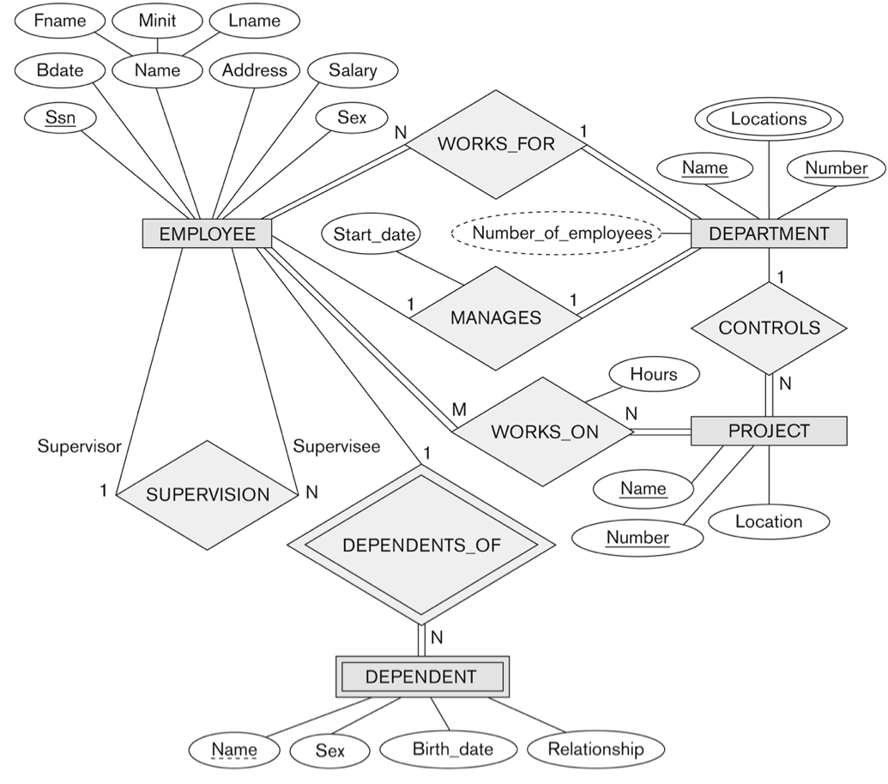
*ER Diagram Example. Squares are entities, diamonds are relations and circles are attributes.*

### Modelling in SQL

If we are implementing this model in a relational database, we first go through a normalisation process. We begin at [First Normal Form](https://en.wikipedia.org/wiki/First_normal_form) (1NF) and by looking for things such as functional dependencies and transitive dependencies, we eventually get to our desired [Third Normal Form](https://en.wikipedia.org/wiki/Third_normal_form) (3NF). 

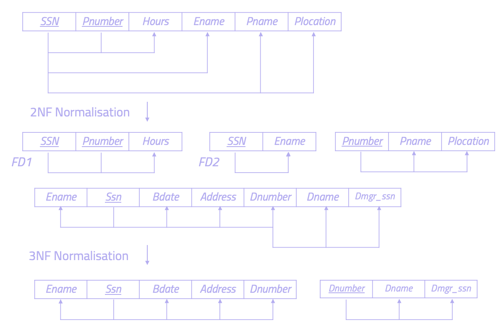
*Normalising from 1NF to 3NF.*

After this normalisation process, we get to our logical model in 3NF and implement it in a relational database. We have gone from our conceptual model (ER diagram) to the logical model (3NF), without ever needing to go down to the physical level of the database. This was precisely the breakthrough that the relational model brought us -- abstracting away the physical level. We call this the physical independence of data. 

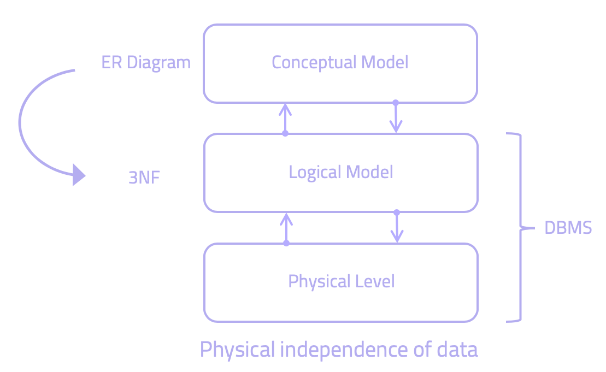
*SQL gives us the Physical Independence of Data.*

### Modelling in Graql

Now let's look at how this compares to Graql. *We can map any ER Diagram directly to how we implement it in Graql*, which means we don't need to go through a normalisation process. Below we can see how a specific part of the earlier ER Diagram is modelled. We avoid the need to do any normalisation, as **Graql enables us to create a direct mapping of the ER Diagram with entities, relations, attributes and roles to how we are implementing it later in code**. This is different to SQL, where we need to impose a tabular structure over our model as a logical layer (as described above).

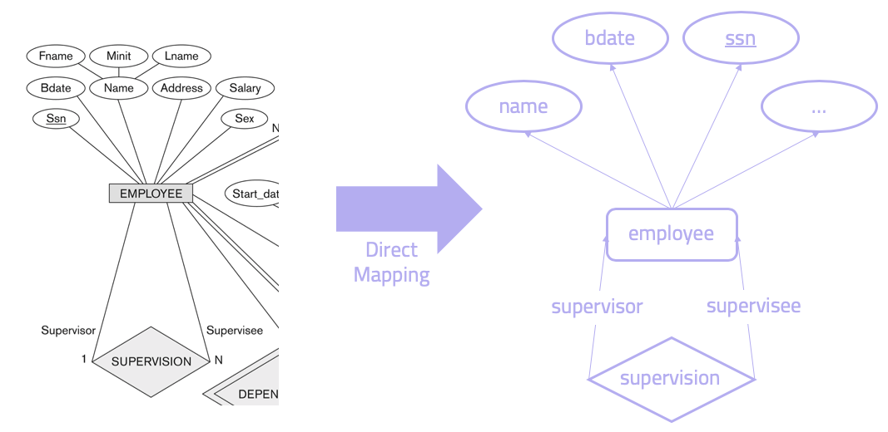
*ER diagram (left) to Graql model (right).*

This means we entirely skip out the normalisation process required in SQL, and we keep working at the conceptual model. In other words, Graql abstracts away both the logical and physical model. **In this sense, where SQL gave us the physical independence of data, Graql gives us the logical independence of data.**

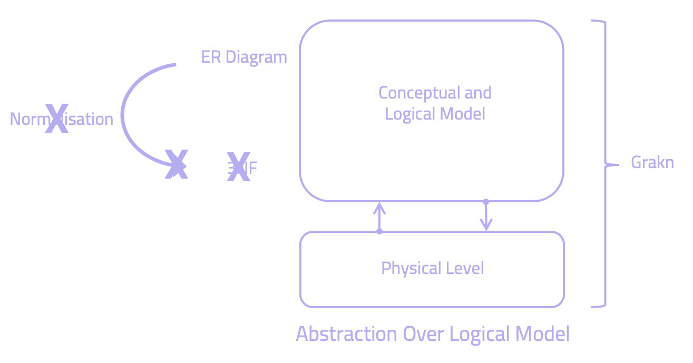
*By modelling at the conceptual level, Graql gives us an abstraction over the logical model.*

### Defining Schemas in SQL and Graql

Now let's look at some real data. Anyone who has studied SQL is probably familiar with the Northwind dataset. It contains sales data for Northwind Traders, a fictitious specialty foods export-import company. 

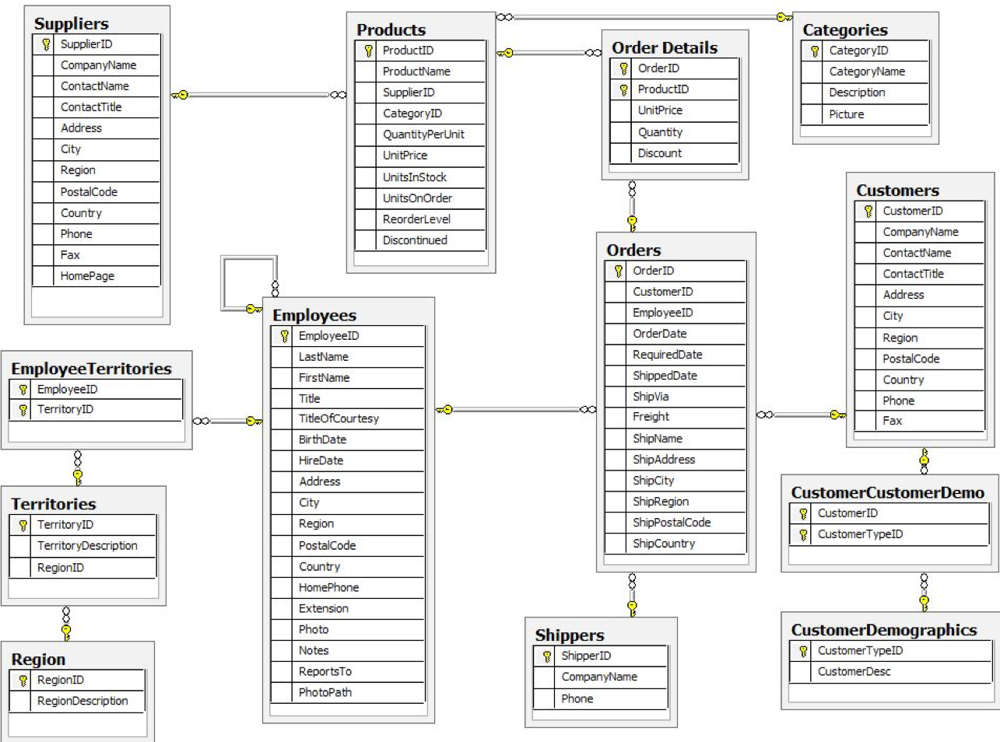
*The Northwind schema.*

How do we go about defining the `products` table shown above in Graql and SQL? Below we see the Graql syntax that defines the `product` entity, and the corresponding `relation`. This also shows the `SQL` statements that create the new table and the corresponding attributes.

<div class="tabs dark">

[tab:Graql]

<!-- test-ignore -->
```graql
define 
product sub entity, 
  key product-id, 
  has product-name, 
  has quantity-per-unit, 
  plays assignment:assigned; 

product-id sub attribute, value double; 
product-name sub attribute, value string; 
quantity-per-unit sub attribute, value double;

assignment sub relation, 
  relates category, 
  relates assigned;
```

[tab:end]

[tab:SQL]
```sql
CREATE TABLE products (
  product_id smallint NOT NULL PRIMARY KEY,
  product_name character varying(40) NOT NULL,
  category_id smallint,
  quantity_per_unit character varying(20),
  FOREIGN KEY (category_id) REFERENCES categories
);
```

[tab:end] 
</div>

A few important points: 

- Here we can see that the SQL table has three attributes, each with their own value type, which we can define in Graql as well. One of these attributes is a `primary key`, which we define in Graql using the `key` keyword. 
- In the SQL statement, there is also a `foreign key`, which depending on our model, we model as a related `relation` in Graql. We do this by connecting the `product` entity to the `assignment` relation using the role `assigned`. 
- In Graql, there is no concept of `null` values. If a concept does not have an attribute, it really does not have it. This is because in a graph context a null attribute is simply omitted from the graph. 
- Finally, an important point is that in the Graql model, attributes are [first-class citizens](https://en.wikipedia.org/wiki/First-class_citizen), unlike in SQL. 

To summarise:

- Modeling an ER diagram into SQL involves a normalisation process from 1NF to 3NF
- The ER diagram maps naturally to Graql, and there is no need to perform any kind of normalisation

## Reading and Writing Data

### Inserting Data

Let's look at how we write and read data using relational operators. First, using the Northwind schema, let's insert the following data: a new `product` with name `Chocolate`, product id `12`, quantity per unit `421` and category name `Confections`.

In SQL, we do two queries. First, we fetch the ID of `Confections` and then we insert the new row. 

```SQL
SELECT category.categoryID
FROM category
WHERE category.CategoryName = "Confections";

INSERT INTO products
VALUES (12, "Chocolate", 42, 421)
```

In Graql we do something different. We first match for the `Confections` category, assign the result to the variable `$c`, and then insert the new data. 

<!-- test-ignore -->
```graql
match 
$c isa category, 
  has name "Confections"; 

insert 
$p isa product,
  has product-id 12, 
  has product-name "Chocolate", 
  has quantity-per-unit 421;   
```

### Reading Data

The basic operational construct in SQL is the `SELECT - WHERE - FROM` expression, which is used to derive new tables from existing ones. 

```SQL
SELECT column1, column2, …
FROM table_name
WHERE condition;
```

The equivalent expression in Graql is the `match-get` expression. 

<!-- test-ignore -->
```Graql
match 
$a isa thing,
  has attribute $v;
get $a, $v;
```

Let's look at some of the most commonly used operators in SQL and how these look in Graql. In doing so, we're going to look at how to think about a query conceptually, instead of looking at the actual code. In this way, the difference between a Graql and a SQL query is that in Graql we think of queries at a conceptual level; the same way we semantically think about a question, rather than imposing a tabular structure over it. 

In the figures below, on the left side, the tabular representation of the query in SQL is shown, and on the right the conceptual representation of the query in Graql (squares are entities, diamonds are relations and circles are attributes).

#### Projection

This SQL operator returns a table that contains all the rows that remain after specific columns have been removed. In Graql, we ask for an entity with specific attribute values.

An example is: 

```Return all product IDs and their unit prices.```

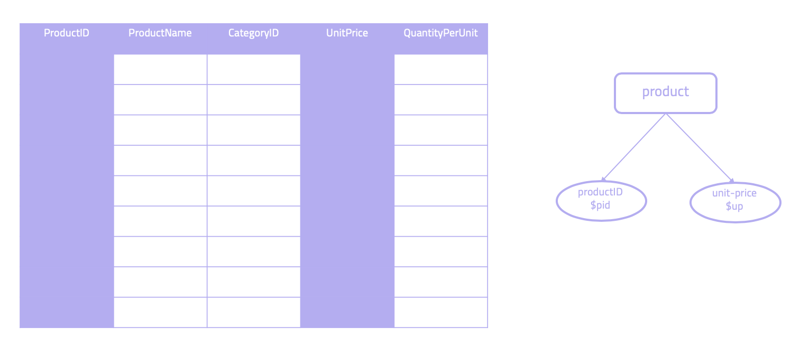
*Table projection (left) and the equivalent operation in Graql (right).*

#### Restrict

This SQL operator gives us a table with rows from a specified table to a specific condition. In Graql, we ask for an entity and its attributes filtered by an attribute with specific values. 

```Return product IDs and product names, for products with a unit price higher than 12.5.```

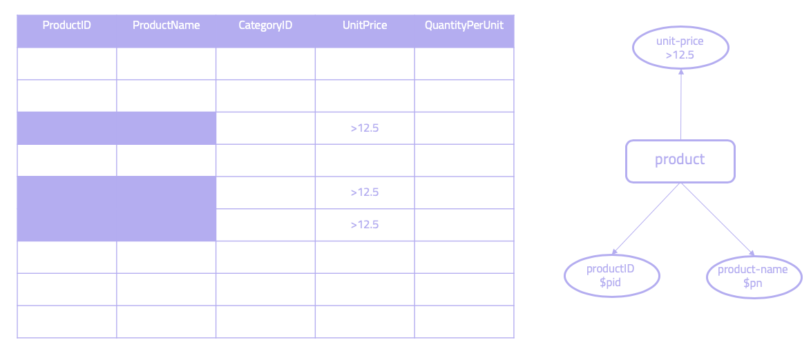
*Table restriction (left) and the equivalent operation in Graql (right).*

#### Union

This SQL operator returns the rows of the tables that appear in either or both of the two specified tables. In Graql, we ask for entities and their attributes that are connected to one or two other entities through a relation. 

```Get all the different cities in which suppliers and customers are located.```

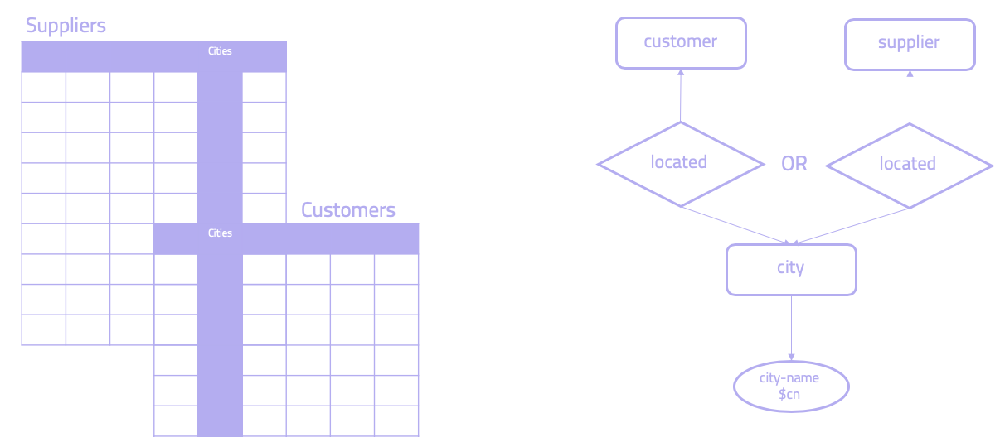
*Table union (left) and the equivalent operation in Graql (right).*

#### Intersect

This SQL operator returns a table with all rows that appear in both of two specified tables. In Graql, we ask for an entity that is connected to two specific entities through a relation.

```Get all the cities in which suppliers and customers are simultaneously located.```

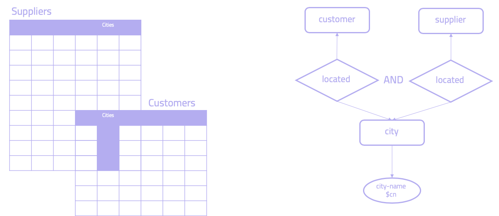
*Table intersection (left) and the equivalent operation in Graql (right).*

#### Join

The most famous SQL operator, a join returns a table containing all possible rows that are a combination of two rows, one from each of two specified tables, such that two rows contributing to any given result row have common values for the common attributes of the two tables. In Graql, we ask for the entities and their attributes that are connected through a specific relation. This means that we don't need any join tables at all, not for 1-1 relations, 1-many relations, or many-many relations. The concept is no longer needed in Grakn. 

```Get all the different cities in which suppliers and customers are located.```

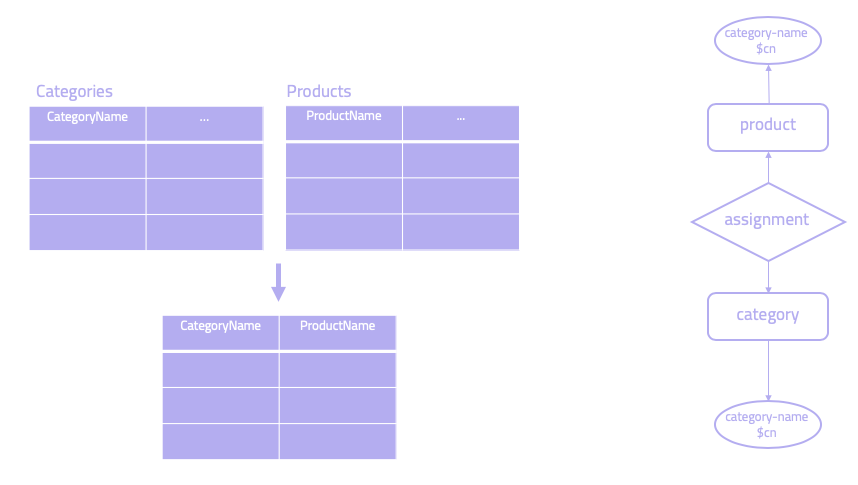
*Table join (left) and the equivalent operation in Graql (right).*

## Modelling at a Higher-Level in Graql: Hypergraph and Automated Reasoning

Compared to SQL, Graql allows us to model at a higher level of abstraction. This means that when we think about queries, we shouldn't actually think in terms of relational operators, as we've just done in the previous section. Instead, we should rethink our model and leverage Graql's expressivity. So, let's revisit the Northwind dataset and think about how we can model it differently. In particular, let's look at how we make use of Grakn's hypergraph and reasoning capabilities. 

### Modelling in Graql 

If we take the `suppliers`, `products`, `employees`, `orders` and `customers` tables from the Northwind dataset, we can model this in Graql by creating the following entities: 
1. `Product`: We map this entity directly to the `products` table (using the singular term instead). 
2. `Order`: This maps directly to the `orders` table. 
3. `Employee`: This also maps directly to the `employees` table.
4. `Company`: As both the `suppliers` and `customers` table refer to companies, we decide to model them as one entity type. We can define a company as a supplier or a customer with roles (see below). 

We then create the following relations and corresponding roles: 
1. `Sale`: We can model this relation as ternary (learn more about [hypergraphs](https://blog.grakn.ai/modelling-data-with-hypergraphs-edff1e12edf0)), as a sale occurs between an `Order` (playing the `order` role), `Company` (playing the `customer` role) and an `Employee` (playing the role of `seller`). 
2. `Stocking`: This relation relates to a `Product` (playing the role of `stock`) which is being stocked by another `Company`, which plays the role of `supplier`.
3. `Containing`: We define this relation between the entity `Order` (playing the role of `order`) and `Product` (role of `contained`), because an order can contain multiple products. We also add two attributes to this relation: `quantity` and `unit-price`. 

This is what we've just modelled: 

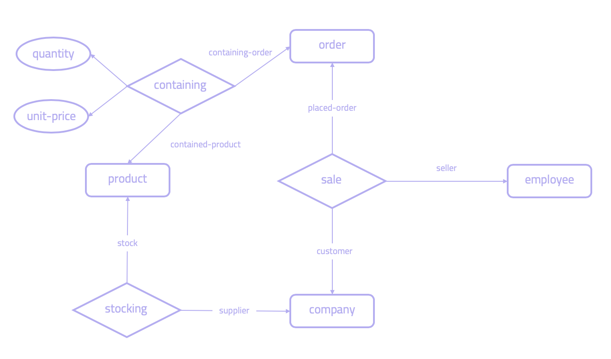
*The model of the Northwind dataset in Graql.*

Let’s see how this looks in Graql: 

<!-- test-ignore -->
```graql
define 

employee sub entity, 
  plays sale:seller; 

company sub entity, 
  plays stocking:supplier,
  plays sale:customer; 

order sub entity, 
  plays sale:order,
  plays containing:order; 

product sub entity, 
  plays containing:contained,
  plays stocking:stock;

sale sub relation, 
  relates order,
  relates seller, 
  relates customer;

containing sub relation, 
  has quantity,
  has unit-price,
  relates contained, 
  relates order;

stocking sub relation, 
  relates stock, 
  relates supplier;

 quantity sub attribute, value double; 
 unit-price sub attribute, value double; 
```

### Traversal Queries

Writing a traversal query in SQL means we leverage the `JOIN` operator. Below is a comparison between SQL and Graql for the following question: 

```Return all employee IDs who sold to a customer based in London, and has customer demographic "x"```

<div class="tabs dark">

[tab:SQL]
```sql
SELECT Employees.EmployeeID
FROM Employees 
  INNER JOIN Orders ON 
    Employees.EmployeeID = Orders.EmployeeID
  INNER JOIN Customers ON 
    Orders.CustomerID = Customers.CustomerID 
    AND Customers.City = 'London'
  INNER JOIN CustomerCustomerDemo ON
    Customers.CustomerID = CustomerCustomerDemo.CustomerID
  INNER JOIN CustomerDemographic ON
    CustomerCustomerDemo.CustomerTypeId = CustomerDemographic.CustomerTypeId 
    AND CustomerCustomerDemo.CustomerDesc = 'x'
```
[tab:end]

[tab:Graql]
<!-- test-ignore -->
```graql
match 
$s isa employee, has employee-id $eid; 
$c isa company, has city "London"; 
$r1 ($s, $c) isa sale; 
$cd isa customer-demographic, has customer-description "x"; 
$r2 ($c, $cd); 
get $eid;
```
[tab:end]
</div>

### Type-based Reasoning

Unlike in SQL, in Graql we have the capability to increase the expressivity of our model by creating a type hierarchy. For example, we can extend the Northwind dataset by adding non-profits, banks and pharmaceutical companies. Conceptually, this looks as follows: 

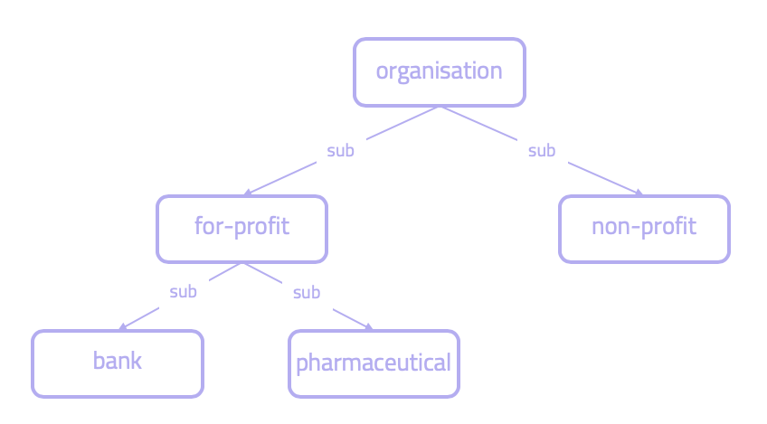
*Type-hierarchy example.*

And in Graql we define it as follows: 

<!-- test-ignore -->
```graql
define 
organisation sub entity; 
  
for-profit sub organisation; 
non-profit sub organisation; 

bank sub for-profit; 
pharmaceutical sub for-profit;
```

### Rule-based Reasoning

With Graql, we can also create rules (learn more [here](https://dev.grakn.ai/docs/schema/rules)) to abstract and modularise our business logic. SQL does not support rules. For example, if we know that location `x` is contained in `y`, which in turn is contained in `z`, we can create a rule that recursively infers that `x` is also contained in `z`. Writing this in Graql looks like this: 

<!-- test-ignore -->
```graql
rule transitive-location: 
when { 
  (located: $x, locating: $y) isa locates; 
  (located: $y, locating: $z) isa locates; 
} then { 
  (located: $x, locating: $z) isa locates; 
};
```

If we look at our Northwind dataset, we can see a transitivity exists between the `Employees`, `Territories` and `Region` tables which means we can leverage the rule above in Graql. To illustrate this point, let's look at this question:

`Return all the employee IDs who are in a region with region-description "x".`

In SQL, this is written as follows: 
```sql
SELECT Employee.EmployeeID 
FROM Employee 
  INNER JOIN EmployeeTerritories AS Et ON
    Employee.EmployeeID = Et.EmployeeID 
  INNER JOIN Territories AS Te ON
    Te.TerritoryID = Et.TerritoryID 
  INNER JOIN Region AS Re ON
    Re.RegionID = Te.RegionID 
    AND Re.RegionDescription = 'x'
```

Having defined the `transitive-location` rule in Graql, we can now directly relate the employee to the region (abstracting away the territory to region connection avoiding us having to make multiple joins): 

<!-- test-ignore -->
```graql
match 
$e isa employee, has employee-id $eid; 
$r isa region, has region-description "x"; 
$r1 (located: $e, locating: $r) isa locates; 
get $eid;
```

If we also incorporate the organisation type-hierarchy shown earlier, we can abstract away even more logic to Grakn. Let's use this question as an example: 

```Return the IDs for customers that are companies and charities, that employees have sold to, and who are in a region with region-description "x".```

In SQL, we write this query like this: 
```sql
SELECT Companies.OrgID 
FROM Companies 
  INNER JOIN Orders ON 
    Companies.OrgId = Orders.OrgId
  INNER JOIN Employees ON 
    Orders.OrgId = Employees.OrgId
  INNER JOIN EmployeeTerritories AS Et ON
    Employees.EmployeeID = Et.EmployeeID 
  INNER JOIN Territories AS Te ON
    Te.TerritoryID = Et.TerritoryID 
  INNER JOIN Region AS Re ON
    Re.RegionID = Te.RegionID 
    AND Re.RegionDescription = 'x'
UNION 
SELECT Charities.OrgID 
FROM Charities
  INNER JOIN Orders ON 
    Charities.OrgId = Orders.OrgId
  INNER JOIN Employees ON 
    Orders.OrgId = Employees.OrgId
  INNER JOIN EmployeeTerritories AS Et ON
    Employees.EmployeeID = Et.EmployeeID 
  INNER JOIN Territories AS Te ON
    Te.TerritoryID = Et.TerritoryID 
  INNER JOIN Region AS Re ON
    Re.RegionID = Te.RegionID 
    AND Re.RegionDescription = 'x'
```

In Graql, we simply write: 
<!-- test-ignore -->
```graql
match 
$c isa organisation, has org-id $ci; # Organisation infers sub entities companies and charities
$e isa employee; 
$r isa region, has region-description "x"; 
$r1 (located: $e, locating: $r) isa locates; 
$r2 ($c, $e) isa sale; 
get $ci;
```

### Conclusion

In conclusion, we've seen how: 
- **Graql provides a higher-level abstraction for working with data.** Graql makes it easier to model and query for complex data. 
- **Graql lets us create conceptual models giving us the physical independence of data.** By implementing a concept level schema, Graql abstracts away the logical model. This means we no longer need to normalise our data.
- **Grakn's reasoning engine simplifies our queries.** By using an automated reasoner, Grakn pushes down lower level operations and enables us to work at a higher level of abstraction.

Grakn's reasoning engine allows us to abstract away logic that otherwise happens in either our query or application layer. Pushing this logic down into Grakn allows us to write simpler queries at a higher-level of expressivity.

There is much more to Graql than what we've tried to show here. Hopefully this comparison has, at least, given the high level similarities and differences between both languages.  

## Resources

- [Grakn Quickstart](https://dev.grakn.ai/docs/general/quickstart)
- [Modelling in Grakn](https://dev.grakn.ai/docs/schema/overview)
- [The Grakn Ontology: Simplicity and Maintainability](https://blog.grakn.ai/the-grakn-ai-ontology-simplicity-and-maintainability-ab78340f5ff6)
